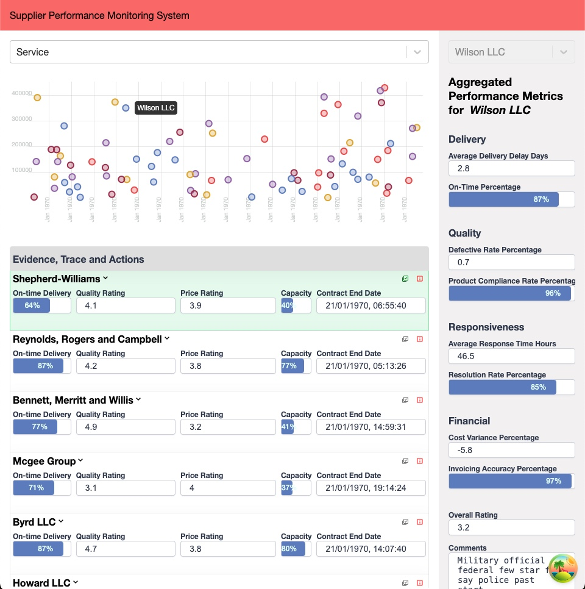
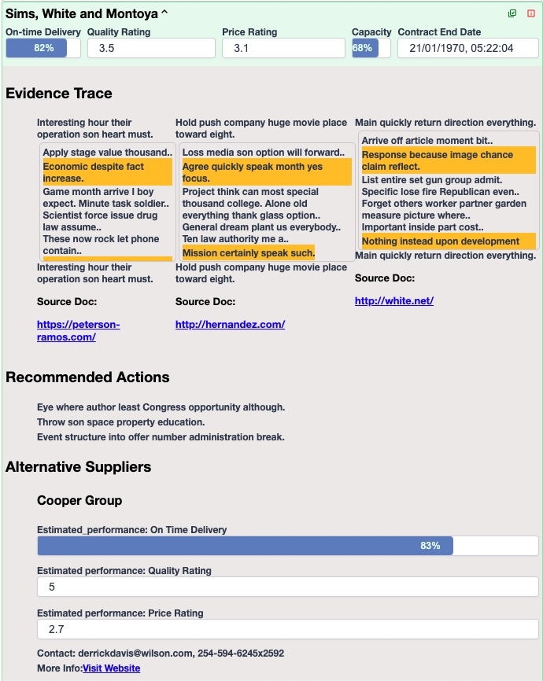
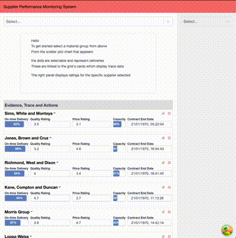

# Connie

### MANUAL APP START CLI COMMANDS

```
 make run-server-fastapi
```

```
 make run-client-react
```

## About

This is a supplier performance monitoring system. This app does track key metrics like delivery performance, quality, compliance, and overall ratings for multiple suppliers. Then, an AI worker identifies the strategy to follow to streamline operations, enhance efficiency, and achieve cost savings while improving supplier relationships (supplier consolidation). The key is to spot outperformance and build stronger partnerships with fewer, more reliable vendors.

The app consists on 3 modules interconnected by a delivery item. The three modules are:

### 1. Chart: A scatter plot

- Shows an overview of all deliveries filtered by the selected material group (deliveries of identical or similar goods).
- On the y-axis we have _expiration-date_ and x-axis _total_amount_. Regardless of the scale's domain used, the idea is to make it easy to stop deliveries that the logistics management worker might need to act upon before anything else.
  For example:
  - **Contract end date** is about to end and the overall rating of the supplier is very poor, those deliveries closer to the far right bottom corner of the chart. The worker might want to substitute these contracts with other more performant suppliers.
  - **Contract end date** is about to end and the overall rating of the supplier is very high, those deliveries closer to the far right top corner of the chart. In this case, the worker might want to extend those contracts, and even extend those contracts if **capacity** allows it

#### Selections on the chart

- Each of the dots in the chart is selectable, and when selected it will filter the other two panels in the view, an **Aggregated Performance Metrics** panel and An **Evidence, Trace and Actions** list.

Lets look at each one in turn:

### 2. Panel: Aggregated Performance Metrics (for the selected supplier)

- Any selection on the list or on the chart will populate this panel where we display **Performance Metrics for the selected supplier** (Delivery, quality responsiveness, financial and overall ratings)

Explanation of the most important fields:

- **Delivery**:
  - _on_time_percentage_: Percentage of deliveries made on time.
  - _average_delivery_delay_days_: Average delay in days for late deliveries.
- **Quality**:
  - _defective_rate_percentage_: Percentage of defective products.
  - _product_compliance_rate_percentage_: Percentage of products compliant with specifications.
- **Responsiveness**:
  - _average_response_time_hours_: Average time to respond to queries.
  - _resolution_rate_percentage_: Percentage of resolved issues.
- **Financial**:
  - _cost_variance_percentage_: Difference in agreed vs actual costs (positive indicates over budget, negative indicates savings).
  - _invoicing_accuracy_percentage_: Accuracy of invoices compared to actual costs.
- **Overall Rating**:
  - _overall_rating_: Supplier rating on a scale of 1 to 5 based on all metrics.

### 3. List: Evidence, Trace and Actions

- A list of current suppliers with their performance metrics, contract details, and capacity information. Also includes potential actions, and new supplier recommendations.

Sections:

- **Capacity information**: helps determine whether a supplier can handle additional workload.
- **Potential Actions**: Steps that the AI worker might recommend, like contacting better-performing suppliers or preparing to terminate underperformers.
- **Alternative Suppliers**: If the current suppliers is inadequate, the AI worker suggests exploring online sources for new suppliers with promising metrics.

## Notes

### General architecture and scaffolding

1. For the frontend, the initial scaffolding is a repo of mine that I use for very small personal projects. [here](https://github.com/msrxse/default-scaffold).
2. Backend is just a simple _FasAPI_ server with inline _DuckDB_ memory database to be seeded from generated json stubs.
3. _React-window_: This is the library I use to display a list with the incoming processed data. This library uses windowing techniques to remove from the DOM before and after rows not visible on the window at any given moment. Allowing resources to be freed from the browser and not block the user actions as the list becomes very big.
4. The* MSW (Mock Service Worker)* library is a popular JavaScript tool for mocking network requests in client-side or server-side applications. It is widely used for testing, debugging, and prototyping API interactions without relying on live servers. The key here is that the stubbed data you use on prototyping will the same available on the jest test environment where tests will be done.
5. _React Query_: This is the library we are using for managing server-state in _React_. It simplifies fetching, caching, synchronizing, and updating data from APIs. The best part is that it caches API responses and reuses data until it becomes stale, does "automatic refetching" and offers "query invalidation".

### About state

- All data in contained in _DuckDB_, where is get seeded in memory on start. A _FastAPI_ _Python_ API serves this data under this endpoints:

1. Read Root

   - GET
   - /

2. Get All Items

   - GET
   - /api/getAllItems

3. Get Material Types

   - GET
   - /api/material_types

4. Get Items By Type

   - GET
   - /api/itemsByType?material_type="Service"

5. Get Suppliers

   - GET
   - /api/suppliers

6. Get Key Metric By Id

   - GET
   - /api/key_metric?delivery_id=0

7. Get Trace Actions
   - GET
   - /api/trace_actions

- Once on the client we use _react-query_ to manage it from there.
- There is a custom hook implements the **context-module-function pattern**. This hook exposes an API and keeps important state internal to the component, exposing only the helper functions required to make changes on the state. Those helper functions will be stable, because they are exported and imported on usage, as well as the required dispatch function needed to call these helper fns. This context state allows the user to keep state of the selected delivery, and it will be available everywhere needed plus any changes will be visible anywhere it is used instantly.

### About testing

I have not made many efforts to have tests in this repo because of time. However I have many examples of how to test different types of components under _jest_ and the _react-testing-library (RTL)_ library.

For example:

- [Example tests on queries and getQueryData functions from react-query](https://github.com/msrxse/oneport-rates-ui/blob/main/src/hooks/rates.ts)
- [Example on tests that use Providers](https://github.com/msrxse/oneport-rates-ui/blob/main/src/hooks/rates.ts)
- [Example tests on components that themselves use hooks](https://github.com/msrxse/oneport-rates-ui/blob/main/src/components/rates/tests/RatesComponent.test.tsx)

### whats missing

- CSS and styles are representative and obviously not something suitable for a production setting
- Typescript not typed 100%
- Theres no documentation other that this document
- Theres many bugs lurking around
- User flow might have needed more time to be understood and usable for actual users
- Data inconsistencies make the code more cumbersome than needed
- Theres no tests, as this is a POC and I was very limited on time
- Under any circumstances this is an example for good practices, theres a lot missing on naming conventions and correct file/structure scaffolding
- Much much more missing that I can count for

### Assets

| Full UI screen                                                           | Open evidence and trace list card                                |
| ------------------------------------------------------------------------ | ---------------------------------------------------------------- |
|  |  |

- User flow video
  
